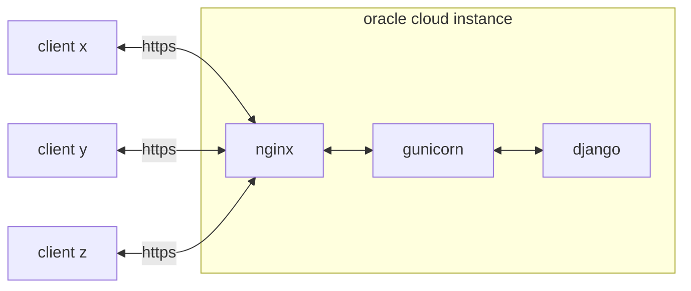

# Deploy a Django app via Oracle Cloud Infrastracture  



- [Deploy a Django app via Oracle Cloud Infrastracture](#deploy-a-django-app-via-oracle-cloud-infrastracture)
  - [Create Oracle Cloud instance](#create-oracle-cloud-instance)
  - [Create DuckDNS domain](#create-duckdns-domain)
  - [Open the ports](#open-the-ports)
    - [Ingress rules](#ingress-rules)
    - [Iptables](#iptables)
  - [Test with NGINX](#test-with-nginx)
  - [SSL certificate](#ssl-certificate)
  - [Configure Django](#configure-django)
  - [Gunicorn](#gunicorn)
  - [NGINX config](#nginx-config)


## Create Oracle Cloud instance  

Go to the [instances section](https://cloud.oracle.com/compute/instances) and create an instance.  

  
  
  
  

You can play with the configuration changing image or adding a block volume (persistent storage) incurring in zero costs as long as you're using **Always Free** services and resources. Finally remember to download the `private key` to access the instance via:  

```
chmod 600 private.key
ssh -i private.key <username>@<instance-ip-address>
```

The `ip address` of the instance can be found in the [instance details](https://cloud.oracle.com/compute/instances) as well as the `username`.  

> This guide assumes the image to be Ubuntu 22.04 where `username` is `ubuntu`  


## Create DuckDNS domain  

  

Oracle does not provide any public `FQDN`, I am sure there are many options here but I decided to create a [DuckDNS](https://www.duckdns.org/) account to get a free subdomain and configure it to point to my instance. It'll be something like:  

```
mylovelyapp.duckdns.org
```

## Open the ports  

At this point we need the instance to be able to communicate with the outside world, this is done in two steps:  

* **ingress rules** for VNIC
* **iptables** (for Ubuntu images)

### Ingress rules  

Ingress rules section can be reach from the [instance details](https://cloud.oracle.com/compute/instances) > subnet > security list > add ingress rules.  

  
  
  
  

Remember to add an ingress rule for both ports 80 and 443 respectively for http and https traffic.  

### Iptables  

Run the following to add the necessary netfilter rules.  

```
sudo iptables -I INPUT 6 -m state --state NEW -p tcp --dport 80 -j ACCEPT
sudo iptables -I INPUT 6 -m state --state NEW -p tcp --dport 443 -j ACCEPT
sudo netfilter-persistent save
``` 

## Test with NGINX  

It's time to get some confidence by testing http communication.  

```
sudo apt update
sudo apt install nginx
```

After the installation the web server should be reachable at `http://mylovelyapp.duckdns.org` showing the nginx welcome page.  

  


## SSL certificate  

Here we're going to create a [DV certificate](https://en.wikipedia.org/wiki/Domain-validated_certificate) using `certbot`, a client that fetches certificates from [Let's Encrypt](https://letsencrypt.org/).  

```
sudo snap install --classic certbot
sudo ln -s /snap/bin/certbot /usr/bin/certbot
sudo certbot --nginx
```

The last command will fetch the certificate and amend the default nginx configuration to use it. The nginx welcome page will now be available also via https.  

## Configure Django  

It's time to start a Django project.  

```
sudo apt install python3-pip
pip install django
python3 -m django startproject mysite
```

Amend `settings.py` to configure `STATIC_ROOT` and `ALLOWED_HOSTS`

```
import os

...

STATIC_ROOT = os.path.join(BASE_DIR, 'static/')
ALLOWED_HOSTS = ["mylovelyapp.duckdns.org"]
```

Collect the static files...  

```
cd ~/mysite
python3 manage.py collectstatic
```

## Gunicorn  

We're going to serve Django through [Gunicorn](https://gunicorn.org/), a python Web Server Gateway Interface (WSGI) HTTP server.  

```
sudo apt install gunicorn
```

Add the confguration file...  

```
sudo nano /etc/systemd/system/gunicorn.service
```
... with the following content:  

```
[Unit]
Description=gunicorn daemon
After=network.target

[Service]
User=ubuntu
Group=www-data
WorkingDirectory=/home/ubuntu/mysite/
ExecStart=/usr/bin/gunicorn --workers 3 --bind 127.0.0.1:8000 mysite.wsgi:application
```

We now want to reload the daemon to reread the service definition and restart the Gunicorn process.  

```
sudo systemctl daemon-reload
sudo systemctl restart gunicorn
```

## NGINX config  

All is left is to configure nginx to communicate with gunicorn, let's create a new nginx configuration for our lovely app.    

```
sudo nano /etc/nginx/sites-available/mylovelyapp
```

Here the nginx configuration.   

```
server {
    listen 80;
    server_name mylovelyapp.duckdns.org;
    
    location /static {
		alias /home/ubuntu/mysite/static;
	}

	location / {
		include proxy_params;
		proxy_pass "http://127.0.0.1:8000";
	}

    # managed by Certbot - start
	listen [::]:443 ssl ipv6only=on;
	listen 443 ssl;
	ssl_certificate /etc/letsencrypt/live/mylovelyapp.duckdns.org/fullchain.pem;
	ssl_certificate_key /etc/letsencrypt/live/mylovelyapp.duckdns.org/privkey.pem;
	include /etc/letsencrypt/options-ssl-nginx.conf;
	ssl_dhparam /etc/letsencrypt/ssl-dhparams.pem;
    # managed by Certbot - end

	if ($scheme = http) {
		return 301 https://$server_name$request_uri;
	}
}
```

Note that the part `# managed by Certbot` can be copied from the default configuration which can now be unlinked.  

```
sudo unlink /etc/nginx/sites-enabled/default
sudo ln -s /etc/nginx/sites-available/mylovelyapp /etc/nginx/sites-enabled
```

Finally we need to add nginx user `www-data` to the group `ubuntu` to grant static files access.  

```
sudo gpasswd -a www-data ubuntu
```

After restarting nginx you should now see Django up and running!  

```
sudo systemctl restart nginx
```

  
